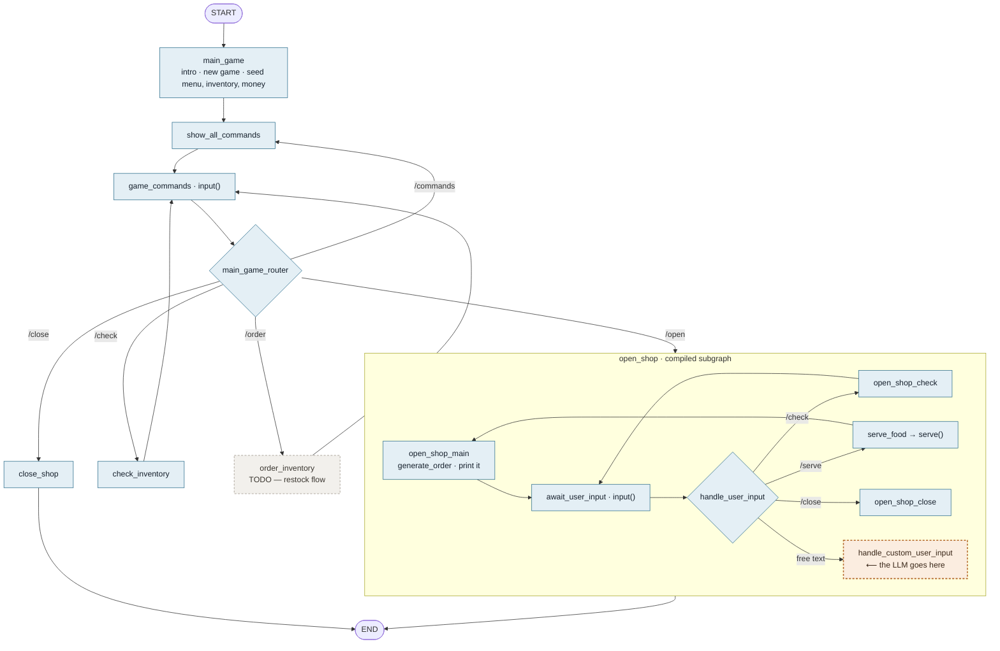
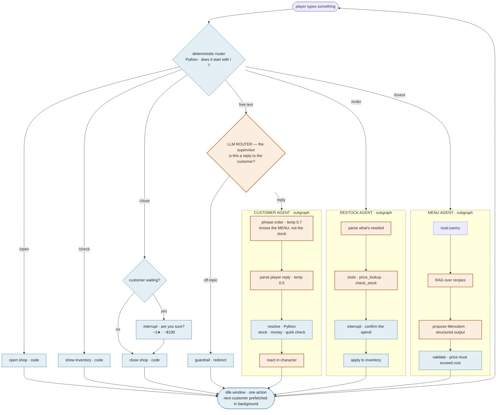

# Curbside — Implementation Plan

A food truck sim in the terminal, run by a local model.

This document describes **what to build and why**. It gives data shapes and function
contracts, not implementations — the code is yours to write.

---

## Where things stand

**Phase 1 complete — the game runs end to end with zero AI.**

- Type model settled: `FoodComponent`, `Ingredient`, `MenuItem`, `FoodOrder`, `GameState`
- `STARTING_INVENTORY` (12 components) and `MENU` (9 dishes), validated
- `can_make`, `serve`, `generate_order` — verified against multi-item, partial-fulfilment,
  and unknown-dish cases
- Main graph: intro → commands → deterministic router → 5 branches
- `open_shop` compiled subgraph, attached as a node (shared `GameState`, so no mapping)
- Verified: serving a chicken quesadilla moves tortilla 18→17, chicken 9→8, cheese 6→4

### Current graph



The two loops inside the subgraph are deliberately different: `check → await` keeps the
same customer waiting, `serve → open_shop_main` brings the next one.

**Next — Phase 2: `handle_custom_user_input`**

The only node that touches a model. One narrow job:

```python
class PlayerAction(BaseModel):
    action: Literal["serve", "check", "close"]
```

`temperature=0`. Given the customer's order and the player's free text, classify into one
of three. Then route to the same three nodes the slash commands already reach.

**Loose ends**
- `handle_custom_user_input → END` means any free text currently exits the shop
- `open_shop → END` in the main graph; probably should return to `game_commands`
- `reputation` is never updated — always prints 0.00
- `total_customers_served` increments unconditionally, so the ratio is always N/N
- `load_game` is defined but unused; there is no save/load yet
- `order_inventory` is still a stub

---

## The one rule

> **Python decides. The model phrases and classifies.**

The model never owns game state. It never invents an order, a price, or a stock level.
It does exactly two jobs:

1. Turn a structured order into a natural sentence a customer would say
2. Turn the player's free-text reply into one of four known intents

Everything else — stock, money, reputation, whether an order can be fulfilled — is
ordinary Python. This is what makes the game unbreakable regardless of what the model
says, and it's the property to protect as the project grows.

---

## Data shapes

These are settled. Defined in `state.py`, populated in `utils/constants.py`.

```python
class FoodComponent(TypedDict):     # a thing in the pantry
    name: str
    remaining_units: int
    cost_price_per_unit: int
    min_purchasable_quantity: int   # restocking buys in packs
    is_spicy: bool
    is_allergen: bool

class Ingredient(TypedDict):        # a line in a recipe
    food_component_name: str        # reference into inventory, NOT a copy
    units_needed: int

class MenuItem(TypedDict):
    name: str
    price: int
    ingredients: Sequence[Ingredient]

class GameState(TypedDict):
    id: UUID                            # save slot; becomes thread_id later
    money: int
    inventory: dict[str, FoodComponent] # single source of truth for stock
    menu: Sequence[MenuItem]
```

Two decisions worth keeping:

**`Ingredient` references by name rather than embedding a `FoodComponent`.** Stock lives
in exactly one place. Embedding would leave every dish carrying a stale copy of
`remaining_units` the moment anything is served.

**`inventory` is a dict, not a list.** Turns `can_make` from a nested search into a
comprehension.

Keep `GameState` flat and JSON-serialisable — the checkpointer in Phase 4 has to
round-trip it.

### Balance built into the data

- `tortilla` appears in 7 of 9 dishes — running out takes most of the menu down at once
- `cheese` starts at 6 units and every cheese dish needs 2 — three servings before the
  first restock decision
- 4 allergens (cheese, sour cream, tofu, peanut sauce), 2 spicy (salsa, jalapeno), so
  the `is_allergen` / `is_spicy` flags have real dishes behind them
- Margins run $3–$7; loaded nachos is the thinnest and most fragile

### Order (generated in Python, never by the model)

```python
order = {
    "items": list[tuple[str, int]],   # [("chicken burrito", 2)]
    "quirk": {"id": str, "note": str | None},
}
```

The **quirk** is the interesting part. `id` is a machine-checkable tag; `note` is the
hint the model uses to phrase it. Because `id` is structured, Python can verify whether
the player handled it — that's what makes this a game with rules rather than a chatbot.

Suggested quirks: `none`, `no_cheese`, `hurry`, `indecisive`, `group`.

---

## Phase 1 — the loop, no AI

**Goal:** a playable game with zero dependencies. *(In progress — data and types done.)*

Build:

```python
def can_make(item: MenuItem, inventory: dict[str, FoodComponent]) -> bool
def serve(item: MenuItem, qty: int, state: GameState) -> bool   # returns success
def generate_order() -> dict                                    # random item + qty + quirk
def phrase_order(order: dict) -> str                            # hardcoded f-string for now
def show_status(state: GameState) -> None
```

Main loop: generate an order → print the phrased sentence → read input → resolve →
print result → repeat. Commands: an item name, `stock`, `quit`.

**`phrase_order` is deliberately a stub.** In Phase 2 you replace its body and nothing
else changes. That's the seam.

**Done when:** you can serve a customer, watch stock go down and money go up, and quit.

---

## Phase 2 — the model plays the customer

**Goal:** replace two function bodies. No structural change.

### 2a. Phrasing

```python
def phrase_order(order: dict) -> str
```

Same signature as Phase 1. Now calls the model with the order and the quirk note, asking
for one or two short casual sentences.

⚠️ **Use `temperature=0.7` here.** You want varied phrasing — the same order twice should
not produce the same sentence.

### 2b. Parsing the player's reply

```python
class Reply(BaseModel):
    intent: Literal["accept", "decline", "substitute", "question"]
    substitute_item: str | None = None

def parse_reply(text: str, order: dict) -> Reply
```

Use `with_structured_output(Reply)`. Give the model the order, the menu, and the reply.

⚠️ **Use `temperature=0` here.** The same reply must classify the same way every time.
Two model instances, two settings, two jobs.

### 2c. Resolving intent

Pure Python. `accept` → serve the order. `substitute` → serve `substitute_item` instead,
if it's on the menu and in stock. `decline` → nothing sold, reputation cost. `question` →
answer from state, don't advance the turn.

### Quirk enforcement

```python
def check_quirk(order: dict, served_item: str, state: dict) -> None
```

Example: quirk `no_cheese` and the served item's `needs` contains cheese → reputation
drops. Deterministic, checkable, no model involved.

**Done when:** customers sound different each time, `"sure"` / `"coming up"` / `"yep"` all
resolve to `accept`, and serving cheese to the allergic customer costs you reputation.

### Config for this phase

```python
ChatOllama(model="qwen2.5:7b", temperature=0.7, num_ctx=8192)   # phrasing
ChatOllama(model="qwen2.5:7b", temperature=0.0, num_ctx=8192)   # parsing
```

`num_ctx=8192` matters — the 4096 default causes stalls on longer prompts.

---

## Multi-agent design

### The patterns

| Pattern | What it is | When to use it |
|---|---|---|
| **Router** | one decision, no loop | the decision is cheap and one-shot |
| **Subagent** | a graph used as a node, with its own prompt, tools, context | you want **context isolation** — it does messy work, returns a summary |
| **Supervisor** | an orchestrator LLM repeatedly picks which specialist runs | several specialists, one coordinator, clear termination |
| **Handoff** | agent A transfers control to B via `Command(goto=...)` | staged workflows where control genuinely moves |
| **Hierarchical** | supervisors of supervisors | large systems; not this one |
| **Network** | every agent can call every other | avoid — chaotic and expensive |

**The point of a subagent is context isolation, not capability.** It can burn ten tool
calls internally and hand back three lines; the parent never sees the mess. Same
context-budget principle as progressive disclosure.

### When something deserves to be an agent

- Needs a **persona** that would conflict with the parent's → agent
- Needs its own **multi-turn tool loop** → agent
- Its intermediate work would **pollute the parent's context** → subagent
- Otherwise → a node, or just a tool

### The three agents in Curbside

| Agent | Verdict | Notes |
|---|---|---|
| **Customer** | genuinely an agent | persona, multi-turn. Knows the **menu**, deliberately *not* the stock — a customer reads the board, not your fridge. If they only ordered what you can make, the "we're out of chicken, want a quesadilla?" mechanic disappears entirely |
| **Restock** | thin — really a tool | arithmetic. Agent-shaped only for conversational ordering ("enough for 20 burritos"). Built as an agent to exercise the pattern; say so out loud |
| **Menu invention** | genuinely an agent, most interesting | constrained creativity: must use stocked ingredients, must price above cost, must return a valid `MenuItem` |

### Routing: deterministic first, LLM only where ambiguous

```
slash command  →  Python router          /open /close /check /order
free text      →  LLM router             reply to the customer, or something else?
```

**Do not route slash commands through an LLM.** `/check` is unambiguous — spending two
seconds and a token bill for a model to re-derive what `if cmd == "/check"` already knows
is how agent systems become slow and expensive for no gain.

Using a supervisor *only* where routing is genuinely ambiguous is the defensible design.
Most tutorials put the supervisor at the front door and pay a model call on every input.

### The whole flow



Blue is your code, amber is a model call. The supervisor is one small amber diamond on a
single branch — everything with a `/` never touches a model.

---

## Commands and the shift loop

| Command | When | Effect |
|---|---|---|
| `/open` | shop closed | start the shift; customers begin arriving |
| `/close` | shop open | end the shift. If a customer is waiting → **`interrupt()`** to confirm; confirming costs −1 star and −$100 |
| `/check` | any time | show inventory. Free, no time cost |
| `/order` | idle window only, never mid-customer | restock conversation with the restock agent |

### Turn structure

- **One customer at a time.** No queue in v1 — the next customer is only generated after
  the current one is resolved.
- **An idle window between customers.** The player gets one action: `/order`, `/check`,
  or continue. Miss it and you wait for the next gap.
- **`/order` pauses the shift.** No customer is generated while a restock conversation is
  in progress.

### Two implementation notes

**Prefetch the next customer.** Generation takes 2–4s on a 7B. Generate it in a background
thread *during* the idle window and reveal it when the window closes, so the latency hides
inside a wait the player was already having.

**Keep the idle window turn-based in v1.** `input()` blocks, so a live countdown needs
threading plus non-blocking stdin — real complexity that teaches nothing about agents.
One action per gap preserves the mechanic. Swapping in a real clock later is a contained
change to one function.

### State this needs

```python
is_open: bool
current_customer: dict | None
reputation: int
day: int
served: int
```

---

## Phase 3 — into LangGraph

**Goal:** same game, wired as a graph. Logic unchanged.

Nodes, one per function you already have:

```
spawn_customer  → phrase_order  → [wait for input] → parse_reply → resolve → respond
```

State becomes a `TypedDict`. Nodes return **only the keys they changed**, never the whole
state — that habit matters once reducers exist.

A conditional edge after `parse_reply` routes on `intent`.

**Done when:** `app.invoke()` produces the same behaviour as Phase 2.

---

## Phase 4 — save and resume

```python
from langgraph.checkpoint.sqlite import SqliteSaver
```

One file, no Docker. `thread_id` identifies the save slot; use `"default"`.

**Done when:** you quit mid-shift, restart the process, and money, stock, and reputation
are exactly as you left them.

---

## Phase 5 — tools and the ReAct loop

Three tools, no more:

```python
@tool
def check_stock(ingredient: str) -> str
@tool
def price_lookup(item: str) -> str
@tool
def restock(ingredient: str, units: int) -> str
```

Bind them to the model, add a `ToolNode`, and close the loop back to the agent node. The
docstring is the only thing the model sees when choosing — write it for a colleague, not
as a code comment.

**Done when:** the model checks stock, finds it short, and offers a substitute unprompted.

---

## Phase 6 — human in the loop

```python
from langgraph.types import interrupt
```

Put it in front of anything irreversible or expensive: restocking (costs money), refunds,
closing for the day.

**Done when:** you can Ctrl+C at the restock prompt, restart, and land back at the same
question.

---

## Phase 7 — recipes via RAG

`data/recipes/` — one short markdown file per dish: ingredients, prep time, substitutions.

```python
def find_recipes(query: str, k: int = 3) -> list[str]
```

Embed the files once at startup with `nomic-embed-text`, embed the query, rank by cosine
similarity with numpy. **No vector database** — ten recipes in a list is the right tool at
this size, and knowing that is worth more than installing pgvector to prove you can.

The query varies genuinely each turn ("what can I make with tortillas and no cheese"),
which is what makes retrieval worth having here.

**Done when:** `"what can I make right now"` returns dishes you actually have stock for.

---

## Phase 8 — skills and guardrails

```
skills/
  upsell/SKILL.md            how to offer a bigger order without being pushy
  complaint/SKILL.md         how to handle an unhappy customer
  guardrails/scope.md        stay in character; refuse off-topic requests
```

Load the frontmatter (`name`, `description`) of every skill into the system prompt at
startup. Load the body only when the model names one. That's progressive disclosure — the
catalogue is cheap, the body loads on demand.

**Done when:** asking the truck to write Python gets a polite redirect instead of Python.

---

## Gotchas already paid for

- **`num_ctx=8192`.** Ollama defaults to 4096 regardless of what the model supports. Too
  small causes stalls that look like hangs.
- **Two temperatures.** 0.7 for generating text a human reads, 0.0 for classification.
- **Never `.format()` an f-string.** It breaks the moment content contains `{`.
- **Return only changed keys** from graph nodes.
- **When the model repeatedly gets enumeration wrong, move the enumeration into Python.**
  Give it a fixed list and ask it only to classify against that list.
- **`Field(description=...)` is prompt engineering**, not documentation — it's sent to the
  model as part of the schema.

---

## Stop points

Any of these is a complete, demoable thing:

- **After Phase 2** — a working game with an LLM customer
- **After Phase 4** — persistent state across sessions
- **After Phase 6** — the full agent stack minus retrieval

Later phases add coverage, not correctness. A finished Phase 4 beats a half-built Phase 7.

---

## Learning resources

**Multi-agent / supervisor / subagents**
- [End-to-End Multi-Agent System: LangGraph, MCP, Supervisor, Guardrails & HITL](https://www.youtube.com/watch?v=BM39OouLNsM)
  — supervisor, guardrails, and HITL together. Closest match to the phases left here.
- [LangGraph Supervisor Agent walkthrough](https://www.youtube.com/watch?v=HonlBK19F1o)
  — tighter, supervisor pattern only.
- [Build a personal assistant with subagents](https://docs.langchain.com/oss/python/langchain/multi-agent/subagents-personal-assistant)
  — official, and better than any video for subagents specifically.
- [`langgraph-supervisor-py`](https://github.com/langchain-ai/langgraph-supervisor-py)
  — the prebuilt. Hand-rolling one router function will teach you more.

**Core LangGraph**
- Docs — https://docs.langchain.com/oss/python/learn
- API reference — https://reference.langchain.com/
- Persistence / checkpointers — https://docs.langchain.com/oss/python/langgraph/persistence
- LangChain Academy, free, modules 0–5 — https://github.com/langchain-ai/langchain-academy

**Tools**
- Ollama — https://ollama.com
- Pydantic — https://docs.pydantic.dev/
